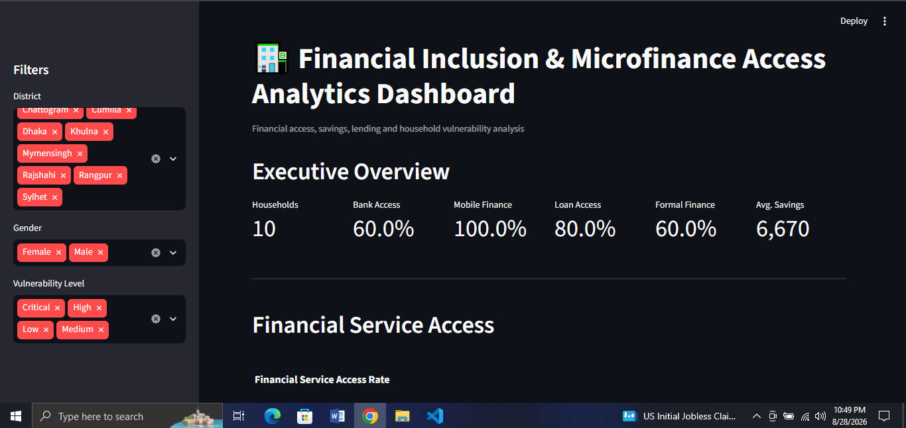

# 🏦 Financial Inclusion & Microfinance Access Analytics Dashboard

An interactive financial inclusion, microfinance access, savings, lending, and household vulnerability analytics dashboard built with Python and Streamlit.

🚀 Live Demo

👉 https://financial-inclusion-microfinance-analytics.streamlit.app/

## 📸 Dashboard Preview



## 📌 Project Overview

This project is a financial inclusion and microfinance access analytics dashboard designed to support data-driven decision-making in financial service planning, microfinance programs, community development, poverty reduction, and household resilience assessment.

The system allows users to monitor financial service access, assess banking and mobile financial service coverage, analyze savings and lending patterns, evaluate financial literacy, monitor loan repayment performance, identify financially vulnerable households, compare districts, and prioritize areas requiring greater financial inclusion support.

The project uses synthetic data for educational and portfolio purposes.

## 🎯 Objectives

* Monitor financial service access
* Assess bank account coverage
* Analyze mobile financial service usage
* Measure formal financial service access
* Monitor insurance access
* Analyze household savings
* Assess loan access and borrowing patterns
* Monitor microfinance participation
* Analyze loan purposes and sources
* Evaluate loan repayment performance
* Measure financial literacy
* Calculate financial vulnerability scores
* Identify critical and high-vulnerability households
* Compare financial inclusion across districts
* Support data-driven financial inclusion planning

## 📊 Key Features

### 🏦 Financial Inclusion Assessment

* Monitor bank account access
* Track mobile financial service usage
* Assess formal financial service access
* Monitor insurance coverage
* Compare financial inclusion indicators
* Analyze financial access by gender
* Compare access across districts

### 💰 Savings & Loan Analysis

* Monitor household savings
* Calculate average savings by district
* Track loan access
* Analyze average loan amounts
* Identify major loan sources
* Analyze loan purposes
* Compare microfinance and bank lending
* Monitor borrowing patterns

### ⚠️ Financial Vulnerability Analysis

* Calculate financial vulnerability scores
* Classify households by vulnerability level
* Identify critical and high-vulnerability groups
* Rank districts based on vulnerability
* Compare vulnerability across locations
* Visualize vulnerability distribution
* Identify areas requiring financial support

### 📚 Financial Literacy & Repayment Analysis

* Monitor financial literacy scores
* Compare financial literacy across districts
* Analyze loan repayment rates
* Compare repayment performance by loan source
* Identify relationships between financial access and vulnerability

### 📍 District-level Analysis

* Compare financial inclusion across districts
* Analyze banking access by district
* Compare mobile finance adoption
* Monitor average savings
* Compare loan access
* Analyze financial vulnerability
* Identify high-risk districts

### 📑 Reporting & Data Exploration

* Interactive household-level data table
* Filter data by district
* Filter data by gender
* Filter data by vulnerability level
* View financial inclusion indicators
* Explore savings and loan records
* Review vulnerability scores
* Analyze financial literacy and repayment performance

## 🛠️ Technologies Used

* Python
* Streamlit
* Pandas
* Plotly
* SQLite
* Git & GitHub

## 🗄️ Database

The application uses SQLite for local data storage.

Main database entity:

`financial_records`

The database stores:

* Survey date
* District
* Upazila
* Gender
* Age group
* Household size
* Monthly income
* Employment status
* Bank account access
* Mobile financial service access
* Savings amount
* Loan access
* Loan amount
* Loan source
* Loan purpose
* Loan repayment rate
* Financial literacy score
* Insurance access
* Formal finance access
* Financial vulnerability score
* Vulnerability level

## 🔄 Data Workflow

```text
Household Financial Assessment
          ↓
SQLite Database
          ↓
Data Processing with Pandas
          ↓
Financial Inclusion Analysis
          ↓
Savings & Loan Analysis
          ↓
Financial Literacy Assessment
          ↓
Repayment Performance Analysis
          ↓
Financial Vulnerability Scoring
          ↓
Risk Classification
          ↓
District-level Comparison
          ↓
Interactive Dashboard
          ↓
Decision Support & Analysis
```
